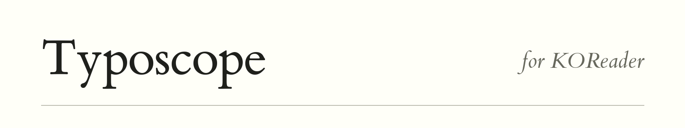

<picture>
  <source media="(prefers-color-scheme: dark)" srcset="docs/assets/images/readme-header-dark.png">
  
</picture>

[Website](https://typoscope.chenna.me/)

Typoscope is a reading-aid plugin for KOReader's reflowable documents. It paints an opaque
overlay around the current line, like placing two pieces of paper over a printed
page. The overlay is dark by default and can be switched to light. It does
**not** recolor or modify the book's text.

## Status and document support

- EPUB, MOBI, FB2, HTML, TXT, RTF and other formats opened with KOReader's
  reflowable reader (CRe) are supported when the reader provides its text-position
  APIs. Support follows the reader's capabilities, not the filename extension.
- PDF, DjVu and other documents opened with the fixed-layout reader have no
  Typoscope menu or mask; assigned Typoscope actions do nothing in those
  documents. Opening them preserves your mask preference.
- Both page and scroll modes use KOReader's rendered text boxes to follow
  individual lines. In a two-page spread, the mask follows all lines on the left
  page before moving to the right page, keeping the other page covered.
- Blank pages and pages without detectable text remain fully visible and use
  normal page turns. There is no fixed-height or manual-slot fallback.
- **Leave pages containing images unmasked** keeps the whole page visible when
  KOReader reports that it drew an image. KOReader currently exposes image
  counts but not reliable screen rectangles for every document engine, so the
  plugin deliberately avoids masking part of an image rather than guessing its
  location.

## Installation

Download the install ZIP from the [latest release](https://github.com/hashb/typoscope.koplugin/releases/latest)
and extract its `typoscope.koplugin` folder into KOReader's `plugins` directory.

Alternatively, copy or clone this directory to KOReader's `plugins` directory, retaining the
`.koplugin` suffix:

```text
koreader/plugins/typoscope.koplugin/
```

Restart KOReader. Open a supported book, then select **Tools → Typoscope reading mask →
Enable mask**.

## Controls

While the mask is enabled, tap KOReader's forward page-turn zone to move to the
next line, or its backward zone to move to the previous line. Tapping past the
final or first line turns the page (or scrolls the view) and moves the slit to
the corresponding edge. At the document boundaries, the slit stays on its
current line and KOReader handles its usual end-of-book action.

The controls follow changes to KOReader's reading direction and tap-zone layout.
Disabling page-turn taps in KOReader also disables these taps; assigned Typoscope
actions remain available. When the mask is disabled, or a page is intentionally
left unmasked, taps turn pages as usual.

Moving within a page requests a cleaning flash only for the strips that become
covered or exposed, to reduce ghosting of previous lines. Those strips may
briefly flicker. This can be toggled via **Flash screen on line change** in the
plugin menu. When disabled, fast partial refreshes are used instead. Actual
page turns retain KOReader's normal refresh behavior. KOReader's global option
to avoid flashing UI refreshes also suppresses cleaning flashes.

The plugin menu under **Tools → Typoscope reading mask** contains:

- **Enable mask**: Toggle the reading mask on or off.
- **Flash screen on line change**: Toggle regional e-ink cleaning flashes on line steps.
  When enabled, toggling the mask or changing its color also flashes the whole
  screen, since those changes replace large areas.
- **Mask color**: Choose a **Dark** (black) or **Light** (white) mask. KOReader's
  night mode inverts the whole screen, so a dark mask appears light in night
  mode and vice versa, matching the inverted page.
- **Line padding**: Adjust vertical padding added around detected lines.
- **Leave pages containing images unmasked**: Keep pages with image content uncovered.

The plugin also registers the following actions with KOReader so they can be assigned in **Gesture
manager**:

- Toggle typoscope
- Typoscope: next line
- Typoscope: previous line

Always assign **Toggle typoscope** to an easy-to-remember gesture before using
the mask extensively; it provides a quick escape if a document has unexpected
layout geometry.

## Development and tests

With Lua and Busted installed, run the startup, touch-control, navigation,
refresh, and geometry tests from this plugin directory:

```sh
busted
```

The specs resolve project files relative to their own location, so they also
work from another directory:

```sh
busted /absolute/path/to/typoscope.koplugin/spec
```

Run all plugin specs from a KOReader source checkout after linking this directory into `plugins`:

```sh
make testfront T=plugins/typoscope.koplugin/spec
```

The unit specs use isolated KOReader stubs without replacing modules in the
surrounding test process. Use the emulator to validate integration with a real
KOReader build.

Run the emulator in a headless VM with Xvfb:

```sh
EMULATE_READER_W=1072 EMULATE_READER_H=1448 \
  xvfb-run --auto-servernum make run RARGS="/absolute/path/to/book.epub"
```

Unit and emulator testing cannot reproduce e-ink ghosting or Kindle-specific
partial refresh behavior. Validate those aspects on a physical device before a
release.

## Releases

The version lives in `_meta.lua`. `0.0.0` means no release has been made yet.
The release script suggests `0.1.0` for the first release, then increments the
patch number. You can type a different `MAJOR.MINOR.PATCH` version at the prompt.

Install Python 3.9+, Git, and the [GitHub CLI](https://cli.github.com/), and log in
with `gh auth login`. Commit your project changes before publishing. From the
repository root, run:

```sh
python3 scripts/release.py
```

The script prepares an install ZIP, shows the destination, version, and files,
then asks before publishing. It commits only the version change in `_meta.lua`,
creates an annotated `vX.Y.Z` tag, pushes the current branch and that tag to
`origin`, and uses your local `gh` to create the release and upload the ZIP and
SHA-256 checksum. It refuses existing tags/releases and never force-pushes.

Release notes include a **What's Changed** list built from commit titles, links
to each commit, and a full-changelog link, followed by installation instructions.
The range starts after the newest lower-version `vX.Y.Z` tag reachable from the
release commit. For the first release, it includes the full history. Merge
commits are omitted; their individual commits are included. The new version-bump
commit is not part of the list. Notes are shown before the final confirmation
and saved to `dist/vX.Y.Z/release-notes.md`.

The ZIP has one `typoscope.koplugin/` folder containing only `main.lua`,
`geometry.lua`, `_meta.lua`, and `LICENSE`. Website assets, videos, tests,
and editing/release scripts stay out of the install package.

```sh
# Build a preview in dist/ without changing Git, _meta.lua, or GitHub.
python3 scripts/release.py --dry-run

# Choose a version directly, or create a draft release.
python3 scripts/release.py --version 1.0.0
python3 scripts/release.py --draft
```

Dry runs package the committed `HEAD`, with the selected version inserted into
the packaged `_meta.lua`; they do not include other uncommitted edits. Use
`--remote NAME` for a different Git remote, or `--version X.Y.Z --yes` to skip
both prompts. A protected branch that prohibits direct pushes must be handled
through your usual branch workflow; the script does not bypass branch rules.

Publishing fetches release tags before generating notes. Dry runs stay offline
and use local tags; run `git fetch --tags origin` first if those need updating.
Use a full clone (or fetch the missing history) so the notes cover the entire range.

If a push or upload fails, the script preserves the local version commit, tag,
and package, and prints recovery instructions. Inspect any existing draft or
partial release before retrying an upload; don't bump the version again just to
retry. GitHub's automatic source archives are separate from the minimal install ZIP.

Run the release integration checks with `python3 scripts/test_release.py`.
They use temporary Git repositories and a fake `gh`; they don't contact GitHub.

## Website

The GitHub Pages site and its images, fonts, and demo video live in [`docs`](docs/).
See [the publishing instructions](docs/README.md) to deploy it and set the repository's
social preview image.
