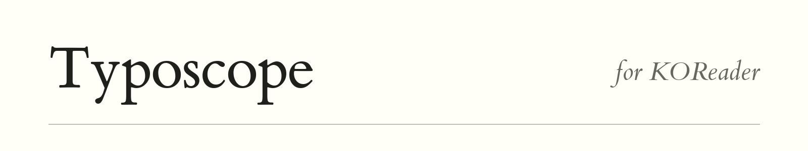

<picture>
  <source media="(prefers-color-scheme: dark)" srcset="docs/assets/images/readme-header-dark.png">
  
</picture>

[Website](https://typoscope.chenna.me/)

Typoscope is a KOReader plugin that simulates a typoscope around the text in
your e-reader. My goal with this plugin is to help people with reading disabilities
to be able to read on an e-reader without distraction or overwhelm. 

Typoscope plugin works by adding an opaque mask around the all of the text except the
line you are currently reading. You can also configure the mask in several ways including
dark/light mode and different mask modes like top only, bottom only or both.

Original                   |  Typoscope dark             |  Typoscope Light
:-------------------------:|:-------------------------:|:-------------------------:
  |    |  

## Installation

1. Download the ZIP file from the [latest release](https://github.com/hashb/typoscope.koplugin/releases/latest).
2. Extract `typoscope.koplugin` folder from the ZIP file.
3. Copy it to the plugins folder (`koreader/plugins/typoscope.koplugin/`)
4. Restart KOReader
5. Open a book
6. Select **Tools → Typoscope reading mask → Enable mask**
